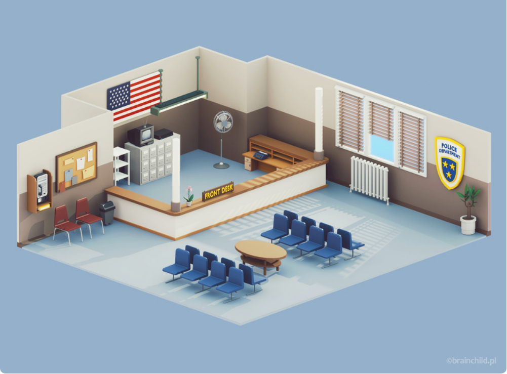

# Exercício - Cidade Alta

> O Departamento de Polícia do Cidade Alta está precisando de um sistema para controlar os códigos penais da cidade. Para isso é necessário uma aplicação onde o usuário irá autenticar-se e após o sucesso poderá consultar, incluir, editar e visualizar os códigos penais da Cidade Alta.

### Metodologia

De início analisei as telas que foram pedidas, tecnologias e os dados dos endpoints. Das tecnologias React, componentização, styled component, typescript, um pouco de redux e alguns hooks já eram conhecidos. O desafio era montar a estilização da tela de forma que não consumisse muito tempo da produção das outras funcionalidades, uma estratégia que utilizo é pegar a peleta de cores de alguma imagem, como da imagem abaixo. Outro desafio foi o reforço dos conhecimentos de Redux, pois havia aplicado brevemente na autentificação e estados de UI de uma aplicação da faculdade.

Comecei fazendo a telregras, porém procurei deixar bem organiza de login, com base no endpoint e a autentificação, não tenho o costuma de fazer a mesma sem que o backend cuide da maior parte destas regras e o complementei com um sistema de token e persistindo o login por um certo tempo de forma local.

Após a tela de login estar funcionando foquei na criação da tela de listagem de códigos penais, o maior desafio foi pensar em uma forma de usar redux já que não havia - até aquela hora não havia testado se o backend tinha ações post, put ou patch para obter uma interatividade backend e frontend mais simbiotica, pensei ter somente os dados obtidos pelos get - como adicionar os dados sem ser de uma forma mais local e manual, isso acabou gerando um problema para manter o estado modificado e no sitema em alguns casos, eu diria que esse é o maior problema da solução desenvolvida. Durante a criação desta tela foi pensado em usar a biblioteca *Prime React* para trabalhar com uma tabela dinâmica que abrangesse as solicitações de paginação, busca e ordenação, porém algumas dificuldade de expêriencia me fizeram mudar de ideia. Assim, resolvi continuar usando a boblioteca de UI da Chakra-ui para produzir a maior parte dos components.

As outras telas e funcionalidades foram as mesmas e com a mesmas dificuldades. Sendo essas, um melhor entendimento do uso do Redux para manter os estados entre telas e ações.